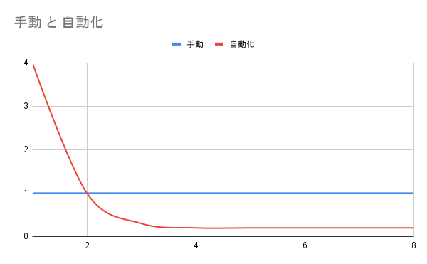

import HoveredText from "../../components/PageContent/HoveredText.astro";

PM/コンサルのようにスプシ、パワポが主戦場ではないですが、基本を抑えておくとなにかと便利なのでご紹介します。<br/>
（Google Spreadsheetが出てきた時の衝撃はすごかった…当たり前のようにPCとともにお金を払っていたExcelが無料でブラウザ上で使えて共同編集できるなんて…。）

## DB ✕ 分析ツール

DB/一覧、分析/表計算ツールをほぼノーコードで作れるのがスプレッドシートの強み。

- 基本的にはデータ部と分析部は分ける
- が、一緒にした方が便利なことも多いのでそこはケースバイケース
- どちらにせよデータは一箇所にして、それを参照（複数箇所で同様データを作らない）



参照などを使って作り込んでいくのはコピペするより最初多少時間がかかりますが、長期的に見ると圧倒的にコスパがいいです。（スプシに限らずですが）最初に<HoveredText displayedText="ちょっと" hoveredText={`作り込みすぎもオーバーエンジニアリングなので、そのバランスが難しいところ。YAGNI大事。`} />時間をかけて作り込む、仕組み化するのを大事にしています。

## 必須級

### ショートカット

| ショートカット | 機能 |
| --- | --- |
| `⌘ + 矢印`<br/>`⌘ + shift + 矢印` | 次データにジャンブ<br/>ジャンプしながら選択 |
| `⌘ + D/R` | 上/左のセルをコピー |
| `⌘ + ⌥ + V` | フォーマットのみ貼り付け |
| `⌘ + -` | 選択範囲削除 |
| `Esc` | 更新せずセルから抜ける。コンサルはだいたいF1キーを剥ぐ。 |
| `F4` | 絶対参照 ※後述 |
| `⌥ + 左右矢印` | シート移動 |

### 関数

| 関数 | 機能 |
| --- | --- |
| `IF` | 条件分岐 |
| `SUM/SUMIF/SUMIFS` | 合計、条件付き合計 |
| `COUNTA` | 個数カウント |
| `COUNTIF/COUNTIFS` | 条件付きカウント。一致確認にも気軽に使える。 |
| `VLOOKUP` | 便利に検索 |
| `&` | 文字結合 |

### 絶対参照

`$`がついた部分が固定され、F4押下で循環します。

- `A1`：相対参照。コピペするとよしなに変わる
- `$A$1`：絶対参照。コピペしても変わらない
    - `$A1`：列は変わらないが行は変わる
    - `A$1`：行は変わらないが列は変わる
    - `$A$1`：行も列も変わらない

### フィルタ vs フィルタ表示

- フィルタ：全員のビューに影響
    - 基本的にはかけない
    - 対象外など全体として永続的にフィルタをかけたいケースのみ
- フィルタ表示：自分のビューにのみ影響
    - 一覧から選択 or URLで他人に共有可能
    - 量産されがちなので、削除していいか分かるように「名前：用途」的な名前をつける

### セルが持っている情報

- 数式
- 計算結果
- 表示、罫線などの書式情報

## よく使う、よくやる

### ショートカット

| ショートカット | 機能 |
| --- | --- |
| `⌘ + ⌥ + V` | フォーマットのみ貼り付け |
| `⌘ + K` | リンク貼り付け |

### 関数

| 関数 | 機能 |
| --- | --- |
| `UNIQUE` | 重複削除 |
| `SPLIT` | 特定文字での分離 |
| `IMPORTRANGE` | 他ファイルのImport |
| `ARRAYFORMULA` | 対象計算を行全体に展開。ソートすると崩れるので注意。 |
| `TEXT` | 表示形式指定 |
| `WORKDAY` | 土日を除いての日数加算。祝日指定も可能。 |
| `CHAR(10)` | 改行文字 |
| `SUMPRODUCT` | 配列の対応する要素同士の積の和 |

### シートを開いた時にすること

- グリッド線を消す
- 表
    - 罫線をいれる
    - タイトル行に色を塗る（色は決めている）
    - 固定する
- 余分な行列を削除

### 条件付き書式

セルに直接色をつけるのはなんでそうしたのかほぼ100％忘れる＆他の書式ルールとかで上書きされて意味不明になりがちなので、ステートで管理するのがいいかなーと思っています。

カスタム数式で行全体の色を変えるみたいなのが見やすくていいかなと思います。

```js
// 範囲
A1:K11

// カスタム数式
=$A1=TRUE
```

※フィルタ、フィルタ表示状態でルールをいじると適用範囲がおかしくなったりするので注意

## TIPS

- 数値は大元のDB以外ベタ打ちせず、必ず参照する
- 計算を無理に一つにまとめず、列を分けて多段にする
    - 途中経過を残しておく。あとで別の使われ方をした時に必要になったりする。
- GASはあまり使わない。基本的にはセルの計算で十分なことが多い
- 結合はフィルタがうまくいかなくなるので使わない主義だったが、最近できるようになったぽいので改宗するか悩む
- カテゴリのような複数行が同じ項目も、全行に書いた方がソート時などに◯
    - 上と同じなら色を薄くする条件付き書式などを設定
- 単位は基本的につけず、表示形式でつける

## その他

- MECEにし易いので、WBSのように項目をブレイクダウンしていくようなものと相性◯
- Excelと比べるとショートカット周りは<HoveredText displayedText="ちょっと弱い" hoveredText={`ブラウザショートカットと喧嘩することも多いので、スプシPCアプリがほしい…。ほしいショートカット\n・固定\n・グループ化`} />
- [zennのメモ](https://zenn.dev/soma3134/scraps/cb45c814cad83f)
